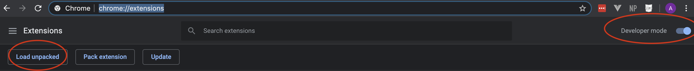

# memory-augmentation
***** This is an extension to [PDF.js's Chromium extension](https://github.com/mozilla/pdf.js/tree/master/extensions/chromium "Github repo of PDF.js for Chrome"). *****

## Setting Up

### Prerequisites
1. Install Google Chrome Browser on your computer if not already installed.

This extension is written for the Google Chrome Browser so you need that. 


2. If you have PDF Viewer on your Chrome Broweser, remove it. 


This extends PDF Viewer Chromium extension. It does everything that pdf.js does and also logs information that helps with our research explained below. So if you have already added pdf.js on your browser, you need to remove it before adding this one.


### Installing
1. Run the following command on your terminal: 

```
git clone https://github.com/azin-z/memory-augmentation.git
```

2. On your Chrome browser, open go to chrome://extensions/.


3. Activate developer mode, if not already active.

4. From the top menu(shown in image below) click the load unpacked button.




5. Select the folder containing the extension cloned in step 1.
